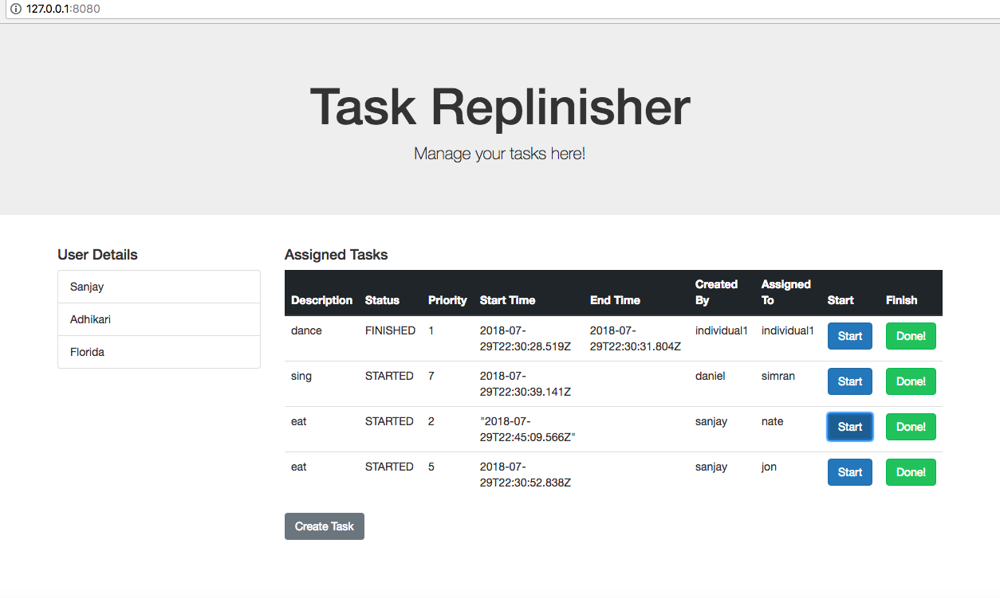
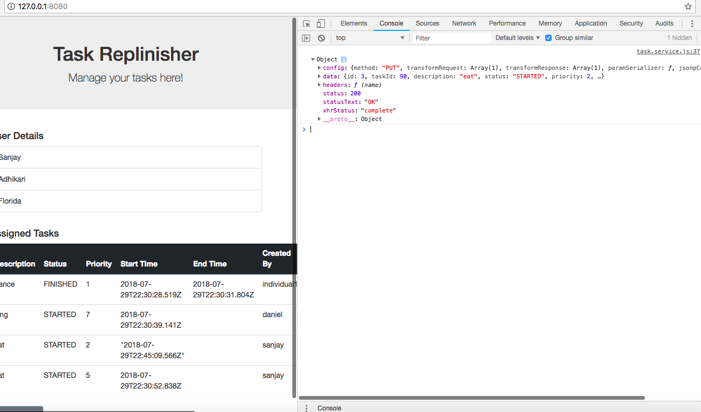

This is the front-end of the Walmart Task Replenisher Application.

About
---------
Currently, the front-end is working on it's own and it's able to successfully make REST api calls. However, after linking it with the backend, it's failing to authorize the user.
Therefore, to test it I am using a fake rest api.


Pre-requisites
---------------
1. Node JS

If node JS is not installed, you can install it from nodejs.org

Verify node js is installed by entering the following command in your terminal or command prompt

```
node -v
```

2. http-server

To install the http server globally on your system, enter the following command in your terminal or command prompt

```
npm install http-server -g
```

3. json-server

It is a Node JS application that lets you create a simple fake REST API endpoint that serves data from a JSON file.

To install the http server globally on your system, enter the following command in your terminal or command prompt

```
npm install json-server -g
```


Steps to run
-------------
Once you have installed the pre-requisites, you can test the app by following the steps below.
1. Go to the taskList-app folder from your terminal or command prompt

2. Start the http-server by entering the following command
```
http-server
```


Now the http server will serve this directory over the given uri
http://127.0.0.1:8080/

3. Go to the taskList-app/data folder and start the json server by :
```
json-server newdb.json
```


4. Now you can go to the uri where the application is running and you would see a log in page

Currently, since it is not actually connected to the actual backend, the authentication is not happening.

5. On clicking the submit button, it making a get request to the fake rest api and displaying the task list.


6. The user can edit status. On clicking the START button, it's making a PUT request and updating the status to "STARTED" and on clicking the DONE button, it's making a PUT request and updating the status to "FINISHED"




7. The user can create a task. On clicking the CREATE TASK button, the user needs to enter the details. On clicking "DONE", the application is making a POST request and the task is getting added to the table


